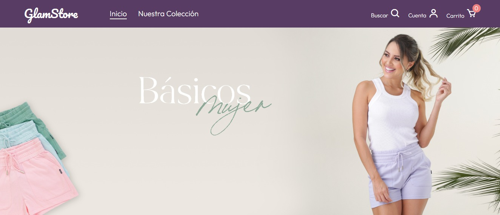

# Tienda Online de Ropa

Este proyecto es una tienda en línea que ofrece una variedad de ropa para dama. Incluye un carrito de compras. La implementación se realiza en Vanilla JavaScript y se utiliza la biblioteca SweetAlert para mejorar la experiencia del usuario.

## Características

- Catálogo de ropa para dama.
- Carrito de compras que permite a los usuarios agregar y eliminar productos.
- Integración de SweetAlert para notificaciones y mensajes emergentes.

## Capturas de Pantalla

---

[Enlace a la interfaz de usuario](https://shopping-cart-nu-three.vercel.app)

---

